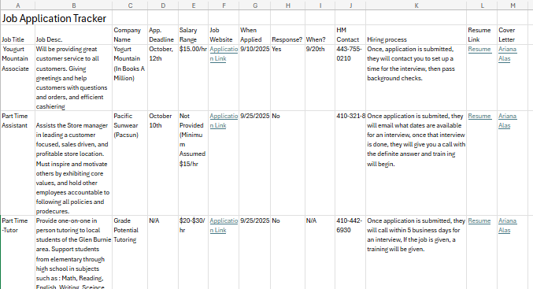
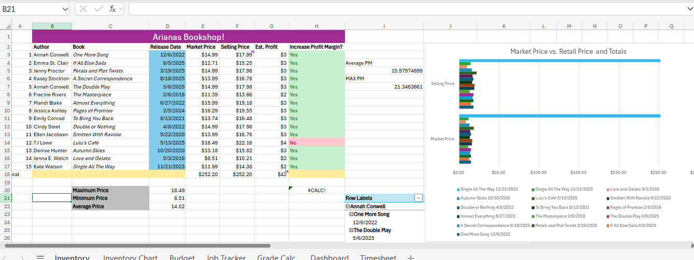

Ariana Alas' Portfolio
Portfolio of Ariana Alas 
# Ariana Alas Portfolio
Portfolio of Ariana Alas
Ariana Alas

### About Me
Hello! I am Political Analysist and a Political Science professional with over 4 years of proven expertise in social data and marginalized populations. With skills in Softwares (eg. Excel, Python, and Access), Leadership, and Analytics, I am able to effeciently analyze numerous amounts of social science data and achieve accurate statistics and numbers. I am adept to using Excel, Statistical Mathmatics, and Python3.
My productive skill set, commitment to effectiveness, and passion for democratic society marks me as a valuable asset. In my spare time, I like to read and travel abroad. 
You can find me on Instagram @ari.alas21 and on Linkedin @ www.linkedin.com/in/ariana-alas-746517398

### Education
**BS in Political Science**  
Loyola University Maryland

### Projects

#### Coded Personality Quiz
- Personality Quiz on GDP
- 
- I came up with this idea for our project by thinking of fun personality quizes i have taken and decidied to put my own twist to it to include my favorite movies, desserts, hobbies, and topics. A lot of people would want to know how they are as a person from a third person point of view so I set myself to solve this by creating fun yet complex questions that determine a personality type based of the answers. I though it would be fun to solve what others were curious about. To complete this project I used onlineGDP for coding, creative thinking skills, and others opinions on the questions. I set out to achieve a quiz that was easy to do and also gave accurate results based off the answers. I did achieve it, but one thing I would change is the aesthetic of it, to make it more welcoming. 
-Summary: In the assigned project we were expected to use our creativity to code our own personality quiz as seen on Buzzfeed! We were assigned to come up with ten questions with four different possible answers, that added up to numbers, and to come up with four different personality types as possible answers depending on what their answers added up to. I really enjoyed creating this project.

***
#### Job Application Tracker
-Job Application Tracker
- 
- I came up with the idea of how I wanted my job application tracker to look like by what i needed focus on mostly in my personal journey with applying to different jobs. I wanted it to be an organized file and sheet where I could see all the jobs I applied to, contact info, and if they responded. The problem I focused on to solve was the disorganization many people have when going through the application process. The mess it can become when we miss emails or dont know to which and how many we have applied to. For me, this needed to be solved in order to be the most productive one can be while looking for a job. To have more order and clarity on which jobs are worth it and which ones aren't. For this project I used Excels formulas and layout. I faced the challenge or getting the correct fomulas and making sure the layout was clean and precised because I still wasn't as familiar with the app. I did not use any other resources but would asked to my fellow classmates and siblings for guidence. I set out to achieve an organized and pleasing application tracker that would get the job done for the user easily and efficiently. I would like to improve the color palatte of the project, which looks a bit bland, and also add more fun fonts. 
Summary: In this assigned project we were expected to create an effective Job Application Tracker, reflecting on our own lives and proccess. We were assigned to find several job opportunities we found interestng on Indeed and use then as if they were our own applications, and some of them became mine! We were told to note the contact infor, the response time, pay, and what tasks we would be responsible to do. 

***
#### Bookshop Inventory Chart   
- Inventory Chart 
- 
-For this project, I took in  my love of books and also one of my future dreams to create an invenotry list of merchandise in my business of a bookshop. I wanted to have a cleana nd effecient list of merchandise, their price, and sale price in fun vibrant colors and layout. For my business, it needed to be solved because it would make stocking and ordering supplies easier. I used Excel and it's formulas. The chalanges I faced were how to lay everything out, and also what books to include. I included my favorite genre. I also had trouble finding the right tables and charts to use for my data but with the help of the assisted lessons I figured a bar graph would work well. I did not use any other resources or peers. I set out to achieve a effecient possibility for future inventory workers and also for myself, with this easy to use graph that makes the job smooth and effective. If I had the chance I would have added poercentage of sales category and more space for product information. 
Summary: In this assigned project we were to create an inventory sheet on items for our make-believe company using excels formulas and layout. I used my love for reading romance novels and my price point due to my economic situation to create a list that was realistic and fun to analyze. I was set to include selling price, item price, th eprice margin, the publication date and other markeeting facts.

